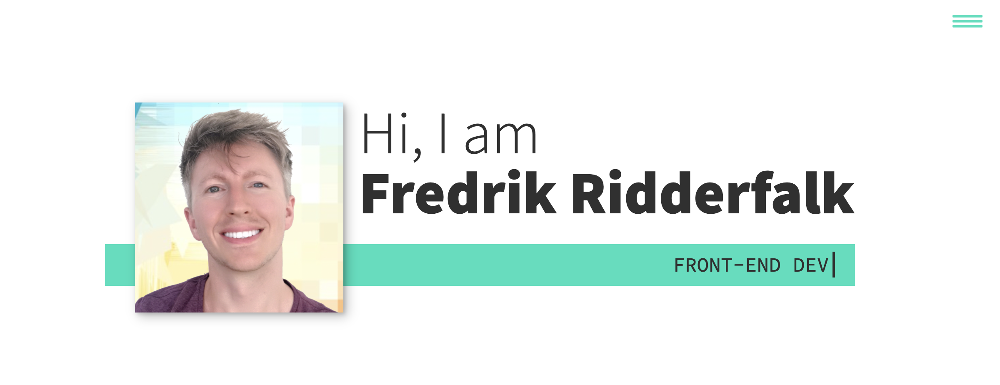

# Personal portfolio featuring my updated collection of projects.

## Table of contents

- [Overview](#overview)
  - [The goal](#the-goal)
  - [Screenshot](#screenshot)
- [My process](#my-process)
  - [Built with](#built-with)
  - [What I learned](#what-i-learned)
  - [Continued development](#continued-development)
  - [Useful resources](#useful-resources)
- [Author](#author)
- [Acknowledgments](#acknowledgments)

## Overview

### The goal

Users should be able to:

- [x] View the optimal layout for the site depending on their device's screen size
- [x] Easily navigate through the site's links and buttons without mouse or trackpad using a clearly visible :focus outline.
- [x] Access all aspects of the site regardless of browser.
- [x] Navigate through the site by a sticky hamburger menu.
- [x] Find out about my services.
- [x] Find out about me.
- [x] Navigate through a portfolio of my work.
- [x] Find contact information.

### Screenshot

## My process

- I organize my html classes using double underscore and double dash to improve readability. This can make it easier to keep track of parent and children elements when working with the css.
- I have added extra padding for links and buttons with small hitboxes to facilitate higher accuracy when using a finger to navigate on a small screen.
- I maintained high contrast ratios (13.1:1, 7.74:1) throughout the website, passing all WCAG tests. Tested using [WebAIM](https://webaim.org/resources/contrastchecker/?fcolor=000000&bcolor=16DFBD).

### Built with

- Semantic HTML5 markup
- CSS
- Flexbox
- CSS Grid
- Mobile-first workflow
- JavaScript

### What I learned

- WCAG 2.0 level AA requires a contrast ratio of at least 4.5:1 for normal text and 3:1 for large text. WCAG 2.1 requires a contrast ratio of at least 3:1 for graphics and user interface components (such as form input borders). WCAG Level AAA requires a contrast ratio of at least 7:1 for normal text and 4.5:1 for large text. Large text is defined as 14 point (typically 18.66px) and bold or larger, or 18 point (typically 24px) or larger.

- How I can work with the css pseudo-elements ::before and ::after. They don't need to be written with double ::, one : will still run, but standard practice nowadays is to use the double ::.

- Instead of trying to make most animations using the animation property and @keyframes, I used the transition property which worked much better in several cases.

- How to code a typewriter carousel in JS.

- I learned how to use CSS grid to produce alternating sections of images and text.

- I learned how to make a typing-animation using pure CSS.

### Continued development

I want to spend more time learning about accessibility and implementing additional measures for an inclusive experience. I want to learn more about internationalization. I look forward to finding new uses for the pseudo-elements ::before and ::after. Next step in development is to deploy the website.

### Useful resources

- [Nu Html Checker](https://validator.w3.org/nu/) - I ran my index.html through this conformance checker to catch any unintended mistakes.
- [CSS Validation Service](https://jigsaw.w3.org/css-validator/) - I ran my style.css through this conformance checker to catch any unintended mistakes.

## Author

- Website - [Coming soon!](#)
- GitHub - [@FredrikRidderfalk](https://github.com/FredrikRidderfalk)
- Twitter - [@yourusername](https://twitter.com/Ridderfalk)

## Acknowledgments

My acknowledgements go out to the team at Scrimba. Enrolling in your courses made this project possible. I learned a lot for this project from Kevin Powell.
